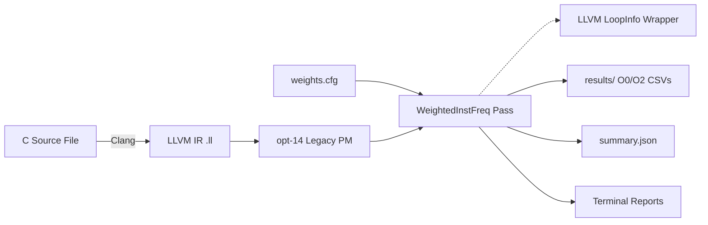

# Design Specification: Weighted Instruction Frequency

This document describes the design principles and architecture of the **Weighted Instruction Frequency Pass**, an analysis tool built on top of LLVM 14.

---

## 1. System Architecture

The Weighted Instruction Frequency Pass operates as a **Legacy FunctionPass** within the LLVM middle-end optimizer toolchain (`opt`).

At its core, the pass traverses the Intermediate Representation (IR) of functions and basic blocks, classifies instructions, looks up weights, integrates loop structure context, and outputs quantitative performance indicators.

---

## 2. Instruction Classification Strategy

Static instruction count is a poor indicator of true CPU execution cost. Different instruction types map to vastly different hardware latencies. To model this, the pass categorizes LLVM opcodes into 7 categories:

| Category | Typical LLVM Opcopes | Typical Hardware Cost Profile | Default Weight |
|---|---|---|---|
| **Arithmetic** | `add`, `fadd`, `sub`, `fsub`, `mul`, `fmul`, `sdiv`, `udiv` | CPU ALU operations (1-4 clock cycles) | `1.0` |
| **Memory** | `alloca`, `load`, `store`, `getelementptr` | Memory access; registers to cache/RAM (3-100+ clock cycles) | `3.0` |
| **ControlFlow** | `br`, `switch`, `indirectbr`, `ret`, `resume` | Branching; risks pipeline stalls or branch mispredicts | `1.0` |
| **Call** | `call`, `invoke`, `callbr` | Function call setup, register spilling, stack frame allocation | `5.0` |
| **Cast** | `trunc`, `zext`, `sext`, `ptrtoint`, `inttoptr`, `bitcast` | Type conversions, often register copies or bit shifts | `1.0` |
| **Comparison** | `icmp`, `fcmp` | Conditional flag evaluations | `1.0` |
| **Other** | `phi`, `select`, `extractelement`, `insertelement` | Administrative instructions | `1.0` |

---

## 3. Mathematical Models & Formulas

### 3.1 Function & Basic Block Cost calculation

For any given block of IR (either a function $F$ or a basic block $BB$), the static cost $C$ is computed as the dot product of the instruction count per category and the configurable weight of that category:

$$Cost(Block) = \sum_{g \in Groups} Count(g) \times Weight(g)$$

Where:
- $Groups = \{Arithmetic, Memory, ControlFlow, Call, Cast, Comparison, Other\}$
- $Count(g)$ is the count of instructions of category $g$ in the block.
- $Weight(g)$ is the user-configured floating-point weight loaded from `weights.cfg`.

### 3.2 Hotspot Determination

A function is flagged as a performance **Hotspot** if its total cost matches or exceeds a user-configured threshold $T$ (passed via the CLI option `-wif-hot-threshold`):

$$IsHotspot(F) = \begin{cases} 
1 & \text{if } Cost(F) \ge T \\ 
0 & \text{otherwise} 
\end{cases}$$

---

## 4. Loop Severity Analysis Design

Loops represent the most critical targets for compiler optimization and execution bottlenecks. To highlight loop properties, the pass integrates LLVM's `LoopInfoWrapperPass`.

### 4.1 Loop Depth Tracking

For each function, `LoopInfo` provides a collection of top-level loops. We traverse these recursively to compute:
1. **Total Loop Count ($L_{count}$)**: The total number of loops (outer loops + subloops).
2. **Maximum Loop Nesting Depth ($D_{max}$)**: The deepest nesting level within a nested loop hierarchy.
3. **Loop Basic Blocks ($B_{loop}$)**: The set of basic blocks that belong to at least one loop.

### 4.2 Loop Severity Classification

We classify loop severity using the following heuristic metrics:

| Loop Count ($L_{count}$) | Max Nesting Depth ($D_{max}$) | Severity Classification | Rationale |
|---|---|---|---|
| $0$ | $0$ | **None** | No loop overhead. |
| $>0$ | $\le 1$ and $L_{count} \le 5$ | **Light** | Flat, simple loops; easy vectorize/unroll. |
| $>0$ | $\le 1$ and $L_{count} > 5$ | **Moderate** | Multiple loops, but no nesting overhead. |
| $>0$ | $\ge 2$ | **Heavy** | Nested loops (loops inside loops) causing exponential iteration complexity. |

---

## 5. Architectural Benefits of Weighted Model

1. **Realistic Performance Profiling**: Reflects processor execution penalties more accurately than simple instruction tallies.
2. **Hardware Target Adaptability**: If targeting an embedded MCU without a hardware divider or floating point unit, the user can increase weights for Call or Arithmetic, matching target latency characteristics.
3. **Optimization Insights**: Highlights why O2 optimizations (such as loop unrolling, call inlining, register promotion) decrease program cost, even if they sometimes increase the total count of instructions.
