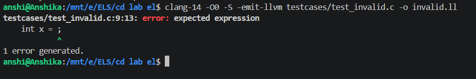

# Weighted Instruction Frequency LLVM Pass

> **Academic Compiler Design Project — LLVM 14 · Legacy Pass Manager · C++17**

This project implements a **custom LLVM analysis pass** that statically analyses LLVM IR (Intermediate Representation) and computes **weighted instruction frequency** for every function and basic block. 

Rather than counting all instructions equally, the pass assigns **configurable cost weights** to instruction categories (Arithmetic, Memory, ControlFlow, Call, Cast, Comparison, Other). This produces a realistic cost estimate reflecting actual hardware behavior — for example, a function call or a memory load is significantly more expensive than a simple integer addition.

---

## IMPORTANT: RUNNING VIA SCRIPTS

> [!IMPORTANT]
> The official, recommended, and supported way to build, execute, and verify this project is using the automated utility scripts in the `scripts/` directory:
>
> ```bash
> ./scripts/build.sh
> ./scripts/run_all.sh
> ```
>
> While manual `clang` and `opt` commands are documented below for educational purposes and conceptual understanding, **all evaluations and verification checks must be run using the scripts.**

---

## Features

- **Instruction Classification**: Categorizes instructions into 7 distinct groups matching LLVM opcodes.
- **Configurable Weights**: external `weights.cfg` file can be updated dynamically without recompilation.
- **Hotspot Detection**: Identifies functions whose total cost meets or exceeds a user-defined threshold.
- **LLVM LoopInfo Integration**: Extends analyses using LLVM's `LoopInfoWrapperPass` to determine total loops, nesting depth, and loops severity (None, Light, Moderate, Heavy).
- **Optimization Impact Analysis**: Computes the delta in instruction count and weighted cost between O0 (unoptimized) and O2 (optimized) builds.
- **Consolidated Exports**: Generates CSV, JSON, and text summaries for easy interpretation or ingestion by the dashboard.

---

## Project Structure

```
cd lab el/
├── src/
│   └── WeightedInstFreq.cpp     # LLVM pass implementation source code
├── scripts/
│   ├── build.sh                  # Official script to compile the pass
│   ├── run.sh                    # Helper script to run a single test case
│   ├── run_all.sh                # Official script to run all test cases (O0 & O2)
│   └── clean.sh                  # Clean script for build/run artifacts
├── testcases/
│   ├── test.c                    # Comprehensive test case
│   ├── test_basic.c              # Basic arithmetic and branching test
│   ├── test_loops.c              # Deep loop nesting test
│   ├── test_recursion.c          # Recursive call overhead test
│   ├── test_memory.c             # Memory load/store intensive test
│   ├── test_matrix.c             # Matrix multiplication test
│   └── test_invalid.c            # Invalid C syntax syntax test (compiler failure check)
├── results/                      # Generated by scripts/run_all.sh
│   ├── O0/                       # Unoptimized analysis outputs
│   ├── O2/                       # Optimized analysis outputs
│   ├── comparison/               # O0 vs O2 comparison CSV reports
│   └── logs/                     # Clang/Opt compiler & execution logs
├── demo/
│   ├── screenshots/              # Screenshots of build, run, and dashboard
│   └── demo_video_link.txt       # Link to the demonstration video
├── dashboard/                    # React frontend dashboard (Optional UI)
├── CMakeLists.txt                # Build system configuration
├── weights.cfg                   # Category weights config file
└── .gitignore                    # Git file exclusion rules
```

---

## Prerequisites

### System Requirements
- Ubuntu 20.04 / 22.04 (or compatible Debian-based Linux environment / WSL)
- LLVM 14, Clang 14
- CMake >= 3.13
- GCC / build-essential

### Install Dependencies
```bash
sudo apt update
sudo apt install -y llvm-14 llvm-14-dev clang-14 cmake build-essential
```

---

## Quick Start (Official Workflow)

Follow these steps to build, run, and evaluate the pass on all test cases:

```bash
# 1. Clone/Navigate to project root
cd "/mnt/e/ELS/cd lab el"

# 2. Grant executable permissions to scripts
chmod +x scripts/*.sh

# 3. Clean any existing artifacts
./scripts/clean.sh

# 4. Build the pass
./scripts/build.sh

# 5. Run the analysis on all test cases (including failure logging)
./scripts/run_all.sh
```

---

## Understanding Manual Execution (For Reference Only)

To run the pass manually on a single IR file:

1. Compile C code to LLVM IR:
   ```bash
   clang-14 -O0 -S -emit-llvm testcases/test_basic.c -o test_basic.ll
   ```
2. Run the legacy pass manager:
   ```bash
   opt-14 -enable-new-pm=0 \
       -load ./build/libWeightedInstFreq.so \
       -weighted-inst-freq \
       -wif-weight-file=./weights.cfg \
       -wif-hot-threshold=30 \
       -wif-out-file=results.csv \
       -wif-summary-file=summary.txt \
       -wif-json-file=summary.json \
       -disable-output \
       test_basic.ll
   ```

---

## Optional Dashboard

The React-based dashboard under `dashboard/` helps visualize the generated statistics. 
> [!NOTE]
> The dashboard is entirely optional and only visualizes the output files. The core compiler pass, scripts, and evaluation are the primary deliverables. If dashboard compilation fails, it will not block compiler pass execution.

To launch:
```bash
cd dashboard
npm install
npm run dev
```

## Screenshots

Here are screenshots demonstrating the execution and output of the pass:


---

## Invalid Test Case

This demonstrates the handling of invalid C syntax code to verify proper error detection and logging:



---

## Final Repository Verification Checklist

Before pushing changes to GitHub, ensure that the repository contains the following files and directories:

- [ ] `README.md` exists and contains instructions.
- [ ] `DESIGN.md` exists.
- [ ] `IMPLEMENTATION.md` exists.
- [ ] `EVALUATION.md` exists.
- [ ] `src/WeightedInstFreq.cpp` exists.
- [ ] `scripts/build.sh` runs and compiles without warnings.
- [ ] `scripts/run_all.sh` runs successfully.
- [ ] At least 5 valid testcases run and generate O0/O2 output CSVs in `results/`.
- [ ] The invalid testcase `testcases/test_invalid.c` generates compiler logs in `results/logs/failure_case_log.txt`.
- [ ] `results/O0/` and `results/O2/` contain outputs.
- [ ] `results/comparison/optimization_comparison.csv` and `results/comparison/evaluation_summary.csv` exist.
- [ ] `demo/screenshots/` contains all five required walkthrough screenshots.
